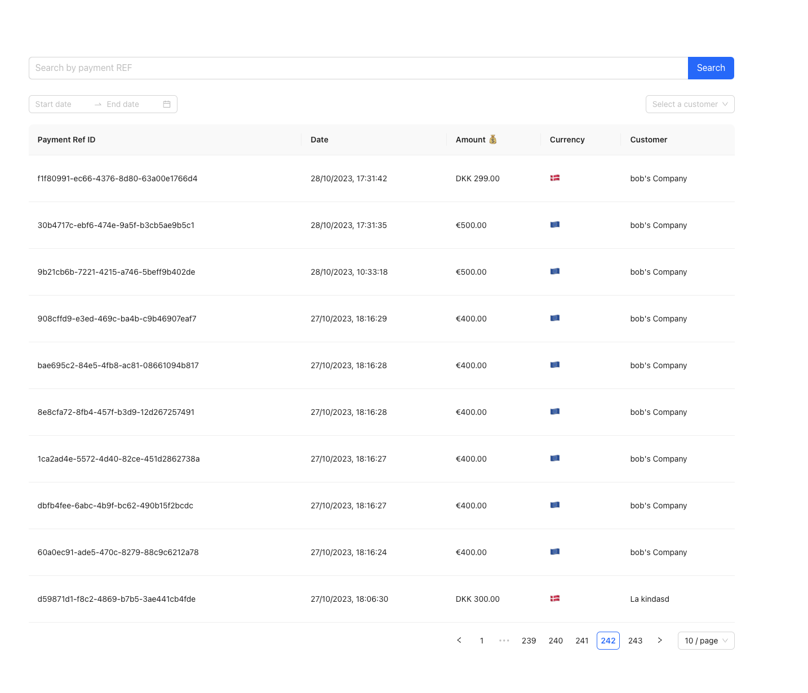

# Wildcat Payments

- [Scoping](#scoping)
  - [1. Display a list of all payments made through the system](#1-display-a-list-of-all-payments-made-through-the-system)
  - [2. Failure Tolerance](#2-failure-tolerance)
  - [3. "100 payments getting into the system"](#3-100-payments-getting-into-the-system)
  - [4. Allow filtering payments per customer 🥅](#4-allow-filtering-payments-per-customer-)
  - [5. Authentication / Authorization](#5-authentication--authorization)
- [First sketch of the architecture 🏰](#first-sketch-of-the-architecture-)
  - [Steps](#steps)
- [Backend 💾](#backend-)
  - [Building blocks 🏗️](#building-blocks-)
  - [Testing 🧪](#testing-)
  - [Performance 🔋](#performance-)
    - [Backend](#backend)
    - [Frontend](#frontend)
- [Frontend](#frontend)
  - [Demo video 🎥](#demo-video-)
- [Improvements](#improvements)
  - [Failure Tolerance](#failure-tolerance)
  - [Deployment](#deployment)
  - [Scalability](#scalability)

<div style="display: flex; justify-content: center;">
	
</div>

_(Generic logo generated by DALL-E 2)_

#### Scoping

#### 1. Display a list of all payments made through the system

- CRUD interface for payments with authentication; payments need to somehow be written to a database.
- I have made the assumption that payments resolve instantaneously. In the real world, that's most likely not the case. I will address this point in the scalability point a bit more below on how we could architect a system that would be able to handle that.

#### 2. Failure Tolerance

- I have also made the assumption that payments do not fail, and there is no recovery strategy or fault failure tolerance. I talk about this a bit more here [Failure Tolerance](#failure-tolerance).

#### 3. "100 payments getting into the system"

**Heavy on writes**

Any framework/language should be able to do this without any significant problem (as long as the function creating the payment isn't doing too many checks). If this number was much higher, I would also consider writing this API in Rust or [something at least much faster than Node](https://tokio.rs/) (not to say that Node is technically slow; it's actually pretty good for I/O-intensive operations).

If we had a larger scale system, we would have to think about how to structure the writes. We would have one write database and multiple read databases, probably.

If the requests per minute are absolutely through the roof, we could also consider a NoSQL alternative instead of Postgres in this case. Apache Cassandra, MongoDB, or Elasticsearch would all work.

**Not too heavy on the reads**

I anticipate some read operations, but it would be nothing too crazy. I would add a Redis instance, for example, to cache user information.

#### 4. Allow filtering payments per customer 🥅

We need to run a couple of filters; in this case, the system can take the following parameters as input:

```
dateRange: from and to date
customerFilter
userFilter
paymentRefID
```

Again, in a real-world scenario, we would optimize things differently depending on what is most often run. You can read more about the [Payment data model](./backend/src/entity/Payment.ts).

The most interesting part in there is that I'm using 2 IDs. One is the primary `id` key (`UUID v4`) that is generated by the DB when it's created.
The second ID is the `paymentRefId`, which is also a `UUID v4` but is completely independent from the primary `id`. You might ask why? The reason is that if we ever were to move the data from Postgres to another database, we would maintain the `paymentRefId` and not carry over the Postgres-generated indexes. The `paymentRefId` is tech-agnostic; it's a business-domain piece of information, so it helps keep things separate and more clear.

#### 5. Authentication / Authorization

We have essentially two types of _users_ in this system:

- One is a `user`, which represents the physical person logging into our system and executing operations.
- The other one is a `customer`, which represents a virtual person executing payment operations (or other things as well).

One `user` can have multiple `customers`. There is a joint table that connects both of them. If I had two shops, I would log in as one `user` and execute `payments` for each of my `shops`.

This way, we would also get very granular permissions that come from this decoupling.

There is no notion of an `ADMIN` role or a `USER` role. Any user has visibility to a `set` of specific `users`. This is due to **prevent** any user from potentially having `full access to the system. It also makes it easier to temporarily grant certain users permissions for certain `customers` and then retract them without granting them full-system access.

A `user` can execute a payment **on behalf of their customer**.

Users get a `jwt_access_token` signed by the server that lasts for a given amount of time. With this access, they'll be able to do any sort of operations they want. I'm no expert in authentication strategies, but I would do my research beforehand on what the trendy authentication strategies are out there, as it is not my field of expertise.

#### First Sketch of the Architecture 🏰

<div style="display: flex; justify-content: center;">
	
</div>

### Steps

In order to spend the least amount of time possible, I've broken down the problems into this minimal set of acceptance criteria:

- ✅ I need to create `users`
- ✅ I need a way to create `customers`
- ✅ I need an endpoint to authenticate users
- ✅ I need a way to create `payments`
- ✅ I need a way to `link` and `unlink` specific `customers` to specific `users`
- ⚠️ Update the `customers` information is missing too
- ✅ I need some tests as I'm writing the code to prevent any refactoring from silently breaking the essential APIs.

Frontend

- ✅ I need to show a table of the payments with a couple of filters
- ⚠️ Internalization and localization were not really thought of
- ⚠️ Mobile support not tested.
- ⚠️ The authorization login/logout step will be omitted for the sake of time
- ⚠️ End-to-end (e2e) testing is missing completely, although I would use `Cypress` if I could.

## Backend 💾

I decided to write a Node REST API because I felt like it would be simpler to keep everything in a TS context.

I did not want to do it in .NET Core or Scala (Akka) because of all the plumbing that is needed to get started.

Django and Ruby on Rails are also renowned for being fast at bootstrapping.

I also thought about writing the payment API in Rust entirely, but I eventually convinced myself that it would take a bit more than just a few hours to do the whole thing.

### Building Blocks 🏗️

- TypeORM
- Express
- Postgres

Steps to run this project:

```
docker-compose up
yarn install
yarn start
(or yarn dev if you want hot-reloading)
```

The database should be maintained in sync automatically. Not a great thing to do in PROD, but it's fine for this demo.

The proper way to do that would be to actually run generate migrations and run them.

I used Sequelize initially but then realized that their typing system was more of an afterthought, and generating migrations and so on was really a headache. (If you use Sequelize/TypeScript, you can't generate them.)

[Sequelize TypeScript](https://github.com/sequelize/sequelize-typescript)

I then pivoted to use [TypeORM](https://typeorm.io/), which turned out to do everything I needed.

It's the first time I either, but I basically needed a many-to-many relationship between customers and users.

## Testing 🧪

There are basic smoke tests. I also didn't bother making them deterministic because of all the plumbing that might be needed due to time constraints.

<div style="display: flex">
	
</div>

## Performance 🔋

#### Backend

It was stable with even 1000 payments. I did not try to go to 10000.

I also added a simple bash script that does exactly 100 payments/second.

[send_100_requests.sh](./send_100_requests.sh)

_The test on Mac 14-inch M1 Pro, 2021 (32GB RAM), which is a fairly strong machine, not sure how it would perform in real-life conditions._

#### Frontend

The performance is really good in the frontend, but I did not run any benchmarks to prove that like Google Lighthouse or so.

## Frontend

I've used React, in conjunction with Antd (component library) that allows creating things quite quickly.

For the networking part, I'm using `axios` and `SWR`.

Nothing really special on this side, to be honest. I'm using normal standard pagination, so there was no need for virtual tables (for performance reasons) and it was just simpler to implement.

In order to run the thing, you can run the following:

```
yarn start
```

### Demo Video 🎥

I made a short video that is accessible here: [Link to video 🔗](https://www.youtube.com/watch?v=94I7R2Fvre8)



## Improvements

### Failure Tolerance

As mentioned in the beginning, with the assumption of payments never failing, I did not implement any failure tolerance.

- Retry queues
- Dead letter queue

Let's assume a database or table to keep track of which payments would fail.

- Retryable failures are routed to a retry queue.
- For non-retryable failures such as invalid input, errors would be stored in that database.

If the payment fails again for one reason or another, the event would be routed to the dead letter queue. We can then use the dead letter queue to investigate payments that failed.

The worst thing that could happen is double-charging a customer, for example.

When we make these retries, we have to make sure that only one of those retry operations goes through.

When doing these retries, there are also a couple of retry strategies that we could use: immediate retry, incremental, and exponential (we would see which one is the best one in our case).


Another problem with this is that we have to make sure that we have an **exactly-once delivery** system. **Idempotency** is crucial here. If multiple concurrent requests are detected with the same idempotency key, only one request should be processed.

When receiving a payment, we would insert a row in the DB. A successful insertion means that the payment that we just received did not exist, so the second request will not be processed.

I did not write a test for it, but this is an interesting test case scenario.

### Scalability


- To ensure the system can handle a large volume of payments without failure, implementing a queue system would be beneficial.
- Considering the potential growth of the payment object, adopting GraphQL could be advantageous. This would allow the frontend to selectively fetch only the necessary data, improving logic and semantics rather than performance.
- Using a language known for its performance efficiency.
- Implementing load balancing to distribute network traffic across multiple servers.
- Distributed database system to improve data redundancy and availability.
- Finally, implementing auto-scaling based on the system load can help to handle peak times efficiently.

### Deployment

I didn't have time for this one.
